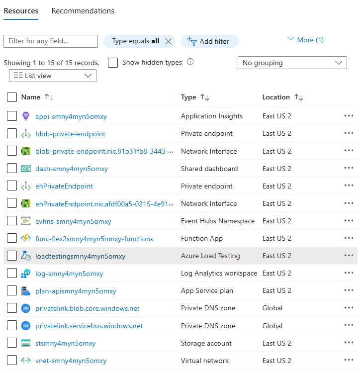

[comment]: <> (please keep all comment items at the top of the markdown file)
[comment]: <> (please do not change the ***, as well as <div> placeholders for Note and Tip layout)
[comment]: <> (please keep the ### 1. and 2. titles as is for consistency across all demoguides)
[comment]: <> (section 1 provides a bullet list of resources + clarifying screenshots of the key resources details)
[comment]: <> (section 2 provides summarized step-by-step instructions on what to demo)


[comment]: <> (this is the section for the Note: item; please do not make any changes here)
***
### Flex Functions End to End Demo

<div style="background: lightgreen; 
            font-size: 14px; 
            color: black;
            padding: 5px; 
            border: 1px solid lightgray; 
            margin: 5px;">

**Note:** Below demo steps should be used **as a guideline** for doing your own demos. Please consider contributing to add additional demo steps.
</div>

[comment]: <> (this is the section for the Tip: item; consider adding a Tip, or remove the section between <div> and </div> if there is no tip)

<div style="background: lightblue; 
            font-size: 14px; 
            color: black;
            padding: 5px; 
            border: 1px solid lightgray; 
            margin: 5px;">

**Tip:** This scenario can be used in both AZ-204 Developing Azure Solutions, as well as in AZ-305 Architecting Azure Solutions. ...
</div>

**Demo scenario story:** ...


<br></br>


<br></br>

***
### 1. What Resources are getting deployed


* **Function App (Flex Consumption):** The Azure Function App hosting the backend API using the dotnet isolated runtime.
* **Event Hubs:** An Event Hubs namespace and event hub for streaming data.
* **Virtual Network:** Contains subnets for the function app, Event Hubs, and load testing resources.
* **Private Endpoints:** Secure connectivity for the storage account and Event Hubs.
* **Application Insights & Monitoring:** For telemetry and live performance metrics.
* **Azure Load Testing:** A pre-installed load testing instance to simulate and assess load performance.



<br></br>


### 2. What can I demo from this scenario after deployment

## Inspect the solution (optional)

1. Once the deployment is done, inspect the new resource group. The Flex Consumption function app and plan, storage, App Insights, Event Hubs, and networking services have been created and configured:

2. The Event Hubs namespace public network access has been turned off so nothing outside the VNet can access Event Hubs. You can check this in the Event Hub Namespace's `Networking` tab and the `Public access` tab:

3. The Event Hubs namespace has a private endpoint configured to one of the subnets in the Vnet. This means it can only be accessed from inside the VNet. You can check this in the Event Hub Namespace's `Networking` tab and the `Private Endpoint connections`:

4. An outbound virtual network integration has been created in your Function App into another subnet in the same VNet. This means it can access the Event Hubs namespace. You can check this in the function app's `Networking` tab in the `Outbound traffic configuration` section:

5. Open the Application Insights instance that was created by the Bicep deploy. Open the `Live metrics` tab to monitor for live events. Notice that it can't connect to the application. This is expected, because the Flex Consumption app is scaled to zero as there's no traffic or executions happening yet.


## Test the solution

1. **Primary Test:** Run the pre-installed Azure Load Testing instance that used the [loadtest.jmx](../loadtest/httppost.jmx) file. This test is already configured to run from a private subnet and will work correctly even if the function app's networking is restricted. Simply start the test to assess the solution's performance.


2. **Alternate Test:** If desired, you may also use a REST client to make HTTP POST calls to the function URL provided by the deployment output. For example, if using VS Code, install the REST Client extension and use the [test.http](../loadtest/test.http) file. The `loadtest` folder also contains sample JSON files for testing.

3. Refresh the Application Insights live metrics and observe the telemetry to ensure successful executions. This confirms that your HTTP calls are flowing through the function app into your VNet-secured Event Hubs instance.

4. Observe from the Azure Load Testing output, or via Application Insights, how the solution scales quickly to handle thousands of requests per second, utilizing Flex Consumption and secured VNet integration.

 (This demo limits to 64 instances by default)

## Clean up resources

Running the load test will quickly create a large collection of function instances that will be slower to delete. Deleting the demo promptly will consume less of your budget. When you no longer need the resources created in this sample, run the following command to delete the Azure resources:

```bash
azd down
```

[comment]: <> (this is the closing section of the demo steps. Please do not change anything here to keep the layout consistant with the other demoguides.)
<br></br>
***
<div style="background: lightgray; 
            font-size: 14px; 
            color: black;
            padding: 5px; 
            border: 1px solid lightgray; 
            margin: 5px;">

**Note:** This is the end of the current demo guide instructions.
</div>